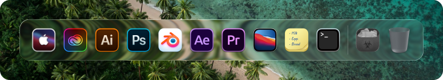

<p align="center">
  
</p>

<h1 align="center">LiquiDock</h1>

<p align="center">
  A macOS-style dock for Windows, with a real liquid glass background.<br>
  Not Electron. Not a WebView. A single native C++/Direct3D 11 executable that idles at zero.
</p>

<p align="center">
  <a href="https://discord.gg/Xxe3zs3sNZ">Discord</a> ·
  <a href="LICENSE">License</a>
</p>

<p align="center">
  
</p>

## What makes it different

Every other Windows dock paints its background from a pre-baked bitmap — a nine-slice PNG stretched
to fit. LiquiDock computes the background per pixel, in a shader, from whatever is actually behind
it: refraction bending the backdrop through the bevel, chromatic dispersion at the rim, frost, and a
specular edge driven by a light angle you control.

- **Real liquid glass** — refraction, depth, dispersion, frost, splay and light, all live and all
  tweakable, and calibrated against the design rather than guessed at: the shipped defaults are the
  numbers that reproduce the Figma frame's own measured blur, rim and edge. Save the settings file
  and the dock re-renders; it watches the file rather than polling it, so tuning costs nothing when
  you are not tuning.
- **The macOS magnification wave** — icons swell under the cursor, and the one under it names
  itself. The size is computed from where the pointer is rather than chased toward it, so there is
  no lag by construction; only leaving eases, because six icons snapping back at once is a jolt.
- **Clicking an app you already have open switches to it** rather than starting a second copy —
  the difference between a dock and a folder of shortcuts. `multiple = on` opts an item back in.
- **Open animations you can choose** — none, bounce, zoom, pulse or glow. Zoom is the default: a
  ghost of the icon swelling and fading. Bounce takes the icon out of the row and the eye follows
  it, which is why it is the one people tire of first.
- **Survives a driver reset** — a TDR or a graphics driver updating itself mid-session rebuilds the
  device and every resource on it, rather than leaving a dock that has to be restarted.
- **Zero idle cost** — the dock is event-driven throughout. Nothing moving means no frames
  presented, no GPU work, no wakeups. Screen capture waits on the desktop's own change
  notifications and ignores changes that miss the dock; running indicators wait on a window event
  hook; the settings file is watched on a waitable handle, not polled.
- **Preferences that were designed**, not accumulated over fifteen years of checkboxes. Every
  setting says what it is *for* underneath its name, and every change applies to the running dock
  as you make it — there is no OK button, because the only way to judge a value like `frost` is to
  see it.

## Status

Early. See the milestones below for where things stand.

| Milestone | Scope | Status |
|---|---|---|
| M0 | Build system, D3D11 + DirectComposition transparent window | done |
| M1 | The liquid glass shader and backdrop pipeline | done |
| M2 | Item model, icons, layout, launching, magnification | done |
| M3 | Multi-monitor, appbar, running indicators, live-capture backdrop | done |
| M4 | Settings UI | done |
| M5 | Portable / Microsoft Store / Steam packaging, code signing | |

## Items

Right-click the dock for *Add app…*, *Preferences…*, and — on an icon — *Open* and *Remove from
Dock*. The **Items** tab has the whole dock as a grid of icons: hover one for its name and path,
click it to edit, drag it to reorder, and click the cross in its corner to remove it. Under a rule
below that grid is everything installed that is not on the dock yet, searchable, one click to add.

The list is stored in `%LOCALAPPDATA%\LiquiDock\items.txt` as blocks, and editing it by hand still
works:

```
[item]
path    = C:\Program Files\Firefox\firefox.exe
label   = Firefox
icon    = C:\Icons\firefox.png
```

`path` is anything the shell can open: a program, a shortcut, a folder, a `shell:AppsFolder\...`
moniker for a packaged app, or a `::{guid}` parsing name. Environment variables are expanded.
`label` and `icon` are optional — without an icon the shell is asked for one.

| Key | Means |
|---|---|
| `kind = separator` | A divider. No path, launches nothing, and it is the **only** thing that puts a rule on the bar. |
| `kind = settings` | The dock's own entry. Clicking it opens these preferences. |
| `multiple = on` | Clicking starts another copy instead of switching to the open one. |
| `show = minimized \| maximized` | How the window comes up. |
| `admin = on` | Launch elevated, through the shell's `runas` verb — so it prompts through UAC rather than the dock running elevated and handing its token to everything it launches. |

There used to be a `group = main \| utility` that put items either side of a hairline the dock drew
by itself. It is still read, and ignored. The hairline hid itself whenever a real divider sat beside
it, so deleting the divider you could see put an identical one you could not in its place — a rule
on the dock is an entry in the list now, and nothing else is.

On a first run there is no file, so the list is seeded from whatever is pinned to your taskbar, plus
Downloads and the Recycle Bin.

## Settings

*Preferences…* in the tray menu, the dock's context menu, or the dock's own icon opens a
custom-drawn panel in six tabs. Changes apply to the running dock immediately and are written back
to the settings file.

**Items** is the dock itself, above. **Glass** is the material. **Dock** is size, magnification and
placement. **Appearance** is the theme, the tint colour, the open animation and the hover label.
**Behaviour** is auto-hide. **Profiles** is below.

That file — `%LOCALAPPDATA%\LiquiDock\settings.txt`, `key = value`, with a comment on every
setting — stays a first-class way in, and *Edit settings file…* opens it. The dock watches it, so
saving takes effect without a restart, and the preferences panel rewrites only the value half of
each line, so comments you add survive being edited from the UI.

A slider takes the mouse wheel and the arrow keys while the pointer is on it, moving by one unit of
whatever it displays — 0.01 for a value shown to two decimals, 1 for one shown to none. Useful when
the value you want is a number rather than a feeling.

| Group | Keys |
|---|---|
| Glass | `backdrop`, `refraction`, `depth`, `dispersion`, `frost`, `splay`, `light-angle`, `light-intensity`, `inner-shadow`, `rim-opacity` |
| Appearance | `theme`, `tint-colour`, `tint-alpha`, `launch-effect`, `separator-image`, `label-font`, `label-font-size`, `label-bold`, `label-opacity`, `label-pad-x`, `label-pad-y`, `label-radius`, `label-gap`, `label-tail` |
| Dock | `icon-size`, `magnification`, `max-scale`, `influence`, `icon-bulge`, `follow-cursor`, `icon-gap`, `divider-gap`, `monitor`, `reserve-space` |
| Behaviour | `auto-hide`, `hide-when-covered`, `dwell-seconds`, `slide-seconds` |

`theme` is `dark`, `light` or `system`. Dark is the design's own — white text on a near-black hover
label, a white hairline for a divider. Light inverts both, and makes the rule a shade stronger,
because a black hairline at twenty percent over a bright desktop is one you have to go looking for.
`system` follows what Windows calls its apps theme and changes with it.

`tint-colour` is what the glass is washed with, as `#rrggbb`, and `tint-alpha` is how much of it.
The tint is a wash over whatever is behind the bar, so a colour here stains the desktop showing
through rather than painting over it. The picker on the Appearance tab is a saturation-and-value
square with a hue rail and eight presets.

`hide-when-covered` is **on** by default and is what makes auto-hide behave the way people expect:
the dock stays out for as long as you are looking at the desktop and tucks away as soon as you are
not. "In the way" means either that an application holds the foreground or that a window overlaps
the dock's strip — the first alone would ignore a window sitting over the dock without focus, and
the second alone leaves the dock on top of an app whose window stops above it. Turn it off to have
the dock hide on its dwell whatever is behind it.

The foreground half of that test asks whether the window in front is one you could actually be
working in — visible, on screen, not minimised, not cloaked. Show Desktop does not clear the
foreground; it leaves the handle pointing at a window that is now minimised, and taking that at
face value is how a dock ends up hiding from an empty desktop.

`reserve-space` makes the dock an appbar, so maximised windows stop above it the way they do above
the taskbar. It is off by default and ignored while auto-hide is on, where a dock that is not on
screen has no business holding room.

`backdrop` decides what the glass refracts. `wallpaper` (the default) decodes your desktop
background once and costs nothing after that — it is exactly right whenever nothing is behind the
dock, and wrong-looking over a window. `screen` refracts what is actually there, by duplicating the
strip of desktop the dock covers and ignoring every change that misses it. The catch is not
performance: the dock has to be excluded from screen capture to stop it refracting its own last
frame forever, and that same exclusion makes the dock invisible in your own screenshots and screen
shares. That is why it is not the default.

`follow-cursor` is **off** by default. On, the row slides sideways as it swells so the icon under
the pointer stays exactly under it, which is what macOS does — and is also why the whole bar appears
to drift left and right as you move along it. Off, the bar holds its centre and grows evenly to both
sides; the hovered icon drifts by a few pixels and the dock sits still.

`separator-image` replaces the divider with an image, stretched to the divider's height and keeping
its own aspect, so a 1×59 hairline stays a hairline. A Nexus theme's `sep.png` drops straight in.
Empty draws the built-in rule.

`icon-gap` and `divider-gap` are the air between neighbouring icons and on each side of a divider.
Both scale with the dock like every other measurement in the layout. Raising `divider-gap` is how a
divider stops being a hairline between two neighbours and starts being a break between runs.

`icon-bulge` is **off** by default. With it on, the glass swells around a raised icon — the bar's
outline fuses to the icons and reads as liquid clinging to them, which is a much stronger effect
than this dock is going for. It is there because it is a good effect, not because it is the right
default.

## Profiles and sharing

The **Profiles** tab keeps named copies of the settings file in
`%LOCALAPPDATA%\LiquiDock\profiles\`. A profile is not a separate format or a subset — it is the
whole file under a name, so switching is a copy, and a profile can be hand-edited, backed up or
sent to someone exactly like the file it came from. Each row offers *Use*, *Copy*, *Save* and
*Delete*.

*Copy my config* puts the whole configuration on the clipboard as one pasteable line — every value
in canonical order, a CRC-32 in front of it, base64url over the lot. Around 890 characters, which
fits a Discord message four times over. *Paste a config* reads one back. The checksum is what makes
it all-or-nothing: a paste that lost its tail is refused rather than half applied.

A token carries settings, not items. Item paths are specific to the machine they came from, so
sharing them would mostly produce broken icons.

## Building

Requires **Windows 10 version 2004** or newer, and Visual Studio 2022 with the *Desktop development
with C++* workload (MSVC v143, Windows 11 SDK, CMake, Ninja).

```
.\scripts\build.ps1                        # debug
.\scripts\build.ps1 -Preset release -Run   # release, then launch it
```

The script finds Visual Studio and enters its developer environment for you. If
you would rather drive CMake directly, do it from a *Developer PowerShell for VS
2022* — the presets pin `CMAKE_CXX_COMPILER` to a bare `cl.exe`, which only
resolves inside that environment:

```
cmake --preset debug
cmake --build --preset debug
```

The executable lands in `build/debug/liquidock.exe`. Or double-click `run.cmd`.

Because the dock's real fill is 5% white and easy to mistake for a failed
render, `run-diagnostic.cmd` draws it in flat opaque magenta instead.

`scripts\sign.ps1` signs a built binary, given a certificate. It does not create
one: an unsigned binary and a binary signed by a certificate nobody trusts both
say *Unknown Publisher*, so a self-signed signature buys nothing except the
appearance of one. The notes at the top of that script cover the three routes
that do work.

## License

Source-available under the [Business Source License 1.1](LICENSE).

You may read, modify, build and use LiquiDock freely, including at work. You may not redistribute or
sell it. On 2030-08-29 this version converts to Apache 2.0.

Official signed builds are sold on the Microsoft Store and Steam — they add auto-updates, cloud
settings sync, and support the development.
